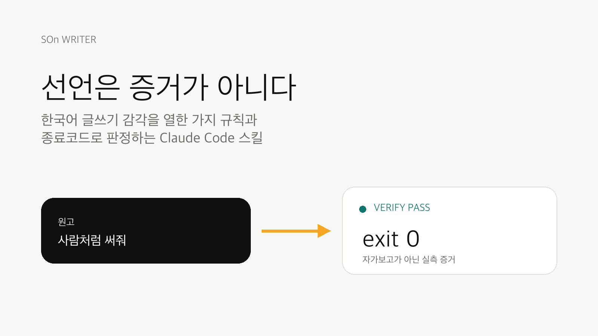
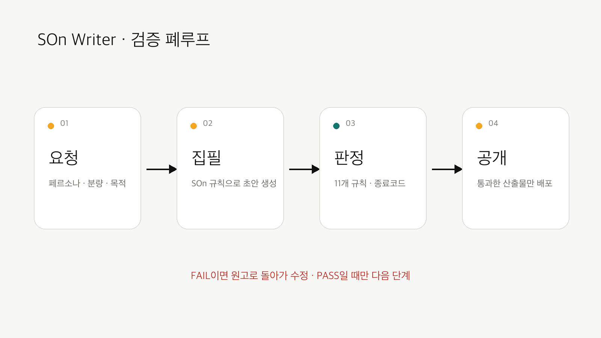
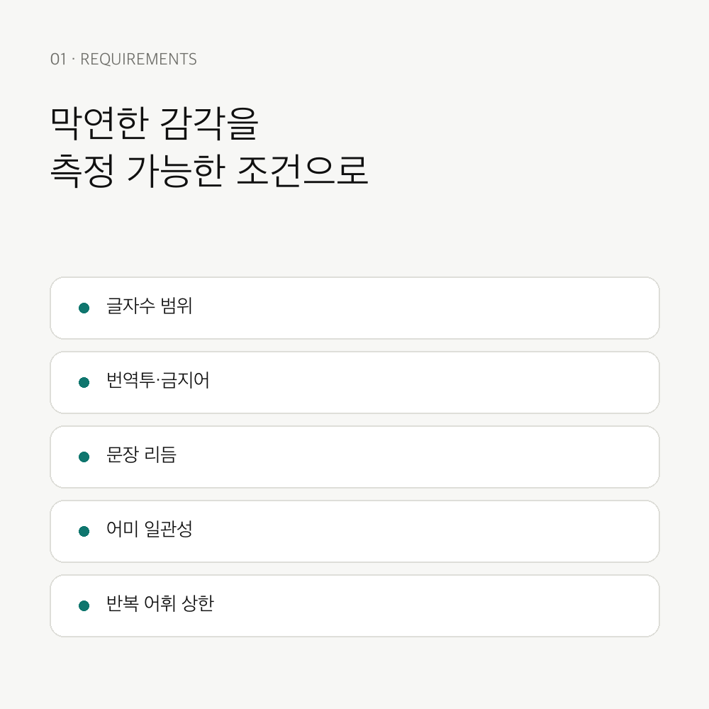
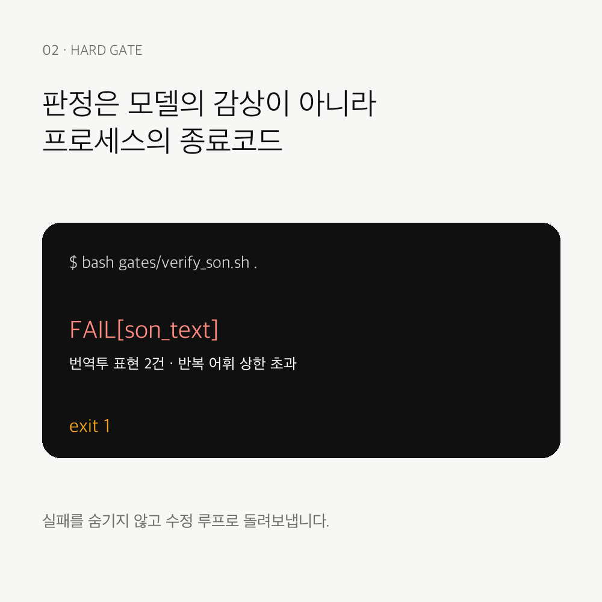
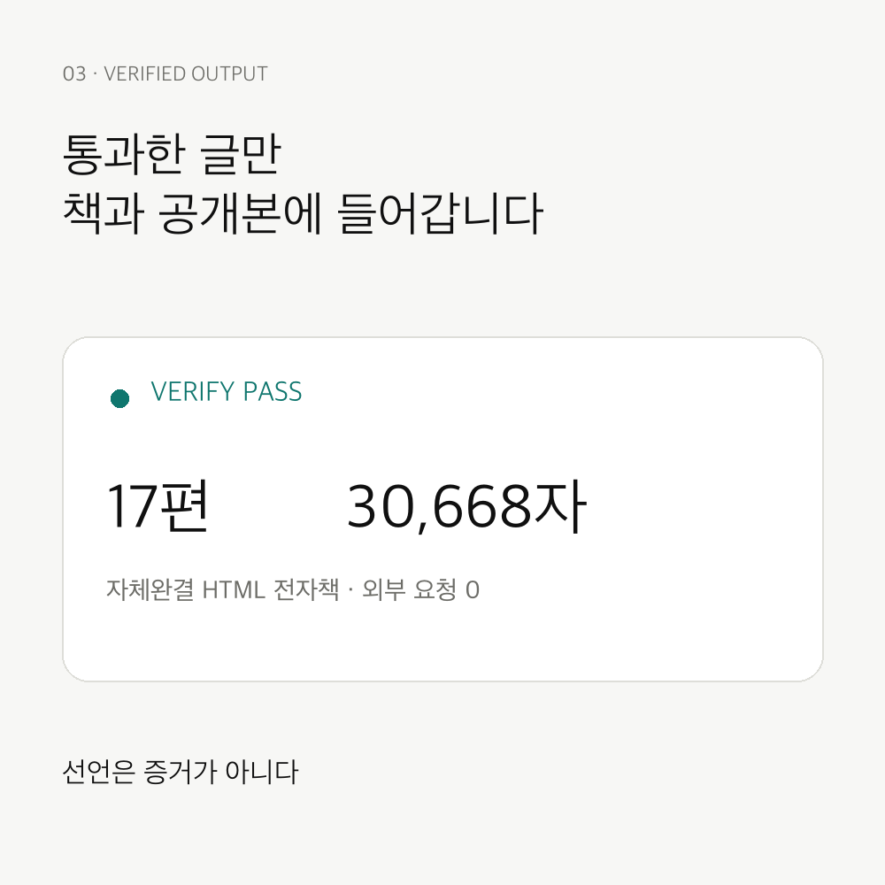

[English](README.md) | [한국어](README.ko.md)

<div align="center">

# SOn Writer



**A fail-closed Korean writing skill that makes “human-like” measurable.**

   

</div>

SOn Writer turns a writing persona and eleven concrete style requirements into a reusable Claude Code skill. Drafts are accepted only when the hard gate exits with code 0; a model saying “this looks natural” is not treated as evidence.

## What is included

- `SKILL.md` — installable Claude Code skill contract
- `REQUIREMENTS.md` — the single source of truth for the writing rules
- `gates/` — length, banned-expression, translationese, rhythm, ending-consistency, repetition, secret, and book gates
- `references/` — redistributable Korean writing references and source ledger
- `evidence/convergence/` — cross-model convergence experiments
- `books/vibe-coding/vibe-coding.html` — a self-contained 17-chapter Korean ebook built with the same engine

## Install the skill

```bash
git clone https://github.com/VoidLight00/son-writer-skill.git
mkdir -p ~/.claude/skills/son-writer
cp son-writer-skill/SKILL.md ~/.claude/skills/son-writer/SKILL.md
```

The skill expects this repository at `~/projects/son-writer`, or an equivalent path updated in your local skill configuration.

## Write and verify

Create a Markdown file in `output/` whose first line declares the accepted character range:

```md
<!-- son: min=1200 max=1800 -->
제목: 골목 끝의 지도 앱

본문을 여기에 씁니다.
```

Then run the judge:

```bash
bash gates/verify_son.sh .
```

Only exit code 0 is a pass. The gate prints `FAIL[gate]: reason` tokens for correction loops.

## The eleven-rule approach

The engine checks what can be checked mechanically and leaves semantic judgment explicit. Its hard checks cover length, empty adverbs, translated phrasing, banned AI-like vocabulary, prose purity, sentence-length variation, opening conjunctions, ending consistency, repetition ceilings, secrets, and publication completeness.



## Example output

The included ebook, **선언은 증거가 아니다**, contains 17 chapters and 30,668 Korean characters. It is a single offline HTML file with light, dark, and system themes.

Open `books/vibe-coding/vibe-coding.html` in any browser.

## Evidence gallery

| Requirements | Fail-closed gate | Verified output |
|---|---|---|
|  |  |  |

## Safety and licensing

The public distribution excludes private corpora and non-redistributable reference code. `ksanyok/TextHumanize` is cited in the source ledger but is not vendored because its commercial terms differ from this repository’s MIT license.

See [SECURITY.md](.github/SECURITY.md), [SUPPORT.md](.github/SUPPORT.md), and [CONTRIBUTING.md](.github/CONTRIBUTING.md).

## License

MIT © 2026 VOIDLIGHT. See [LICENSE](LICENSE).
